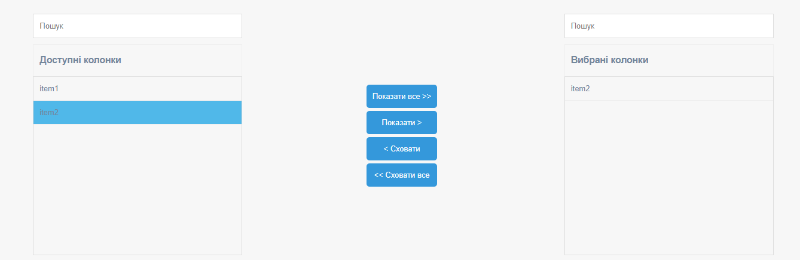

dual-listbox
============
dual listbox  widget

Installation
------------

The preferred way to install this extension is through [composer](http://getcomposer.org/download/).

Either run

```
php composer.phar require --prefer-dist pechenki/yii2-dual-listbox "*"
```

or add

```
"pechenki/yii2-dual-listbox": "*"
```

to the require section of your `composer.json` file.


Usage
-----

Once the extension is installed, simply use it in your code by  :

```php
    $data = ['item1','item2','item2'];
    $values = [1];

    echo \pechenki\duallistbox\DualListBox::widget([
            'items'=> $data,
            'selection'=> $values,
            'clientOptions' => [
                'availableTitle'=> 'Доступні колонки',
                'selectedTitle'=> 'Вибрані колонки',
                'addButtonText'=> 'Показати >',
                'removeButtonText'=> '< Сховати',
                'addAllButtonText'=> 'Показати все >>',
                'removeAllButtonText'=> '<< Сховати все',
                'searchPlaceholder'=> 'Пошук'
            ]

    ]); ?>
```
